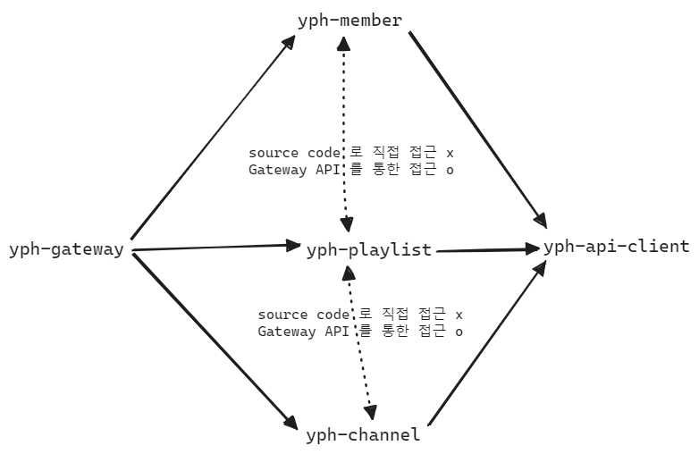

yph-gateway
- 사용자에게 노출하는 Gateway
- graphql, Gateway, RateLimiter

 

yph-api-client
- youtube-playlist api 를 호출하는 역할
- REST API, openfeign, (circuit breaker)

 

yph-member
- 사용자 인증 (OAuth2), 사용자 관리

 

yph-dataaccess
- dataaccess

yph-core
- 공통라이브러리 등을 모아두는 곳

